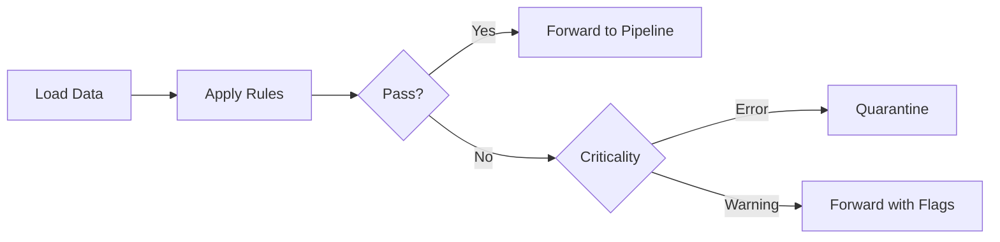

# DQX Data Quality - Quality Data Repository

A scalable, transparent, and auditable data quality framework for managing data reliability across layers and products in Databricks.

---

## 📋 Table of Contents

- [Overview](#overview)
- [Step-by-Step Process](#step-by-step-process)
  - [1. Preparation of Data Quality Rules](#1-preparation-of-data-quality-rules)
  - [2. Configuration File Set-Up](#2-configuration-file-set-up)
  - [3. Data Profiling Output](#3-data-profiling-output)
  - [4. Executing Unified Databricks Job](#4-executing-unified-databricks-job)
  - [5. Applying Data Quality Checks](#5-applying-data-quality-checks)
  - [6. Quarantine and Audit Logging](#6-quarantine-and-audit-logging)
  - [7. Monitoring and Re-introduction](#7-monitoring-and-re-introduction)
- [Key Features](#key-features)
- [Getting Started](#getting-started)

---

## 🎯 Overview

DQX provides a comprehensive framework for implementing data quality checks across your data pipeline. The system enables:

- **Rule-based validation** using YAML configurations
- **Multi-layer support** (Bronze, Silver, Gold)
- **Automated quarantine** for failed records
- **Audit logging** for compliance and debugging
- **Environment-specific** configurations (DEV, QA, UAT, PROD)

---

## 🚀 Step-by-Step Process

### 1. Preparation of Data Quality Rules

Under each product-specific folder in the Github repository, create YAML files that capture all relevant data quality rules.


#### Rule Definition

Each YAML file should specify expectations such as:
- ✅ Required fields
- 📊 Value ranges
- 📝 Enumeration lists
- ⚠️ Acceptable null percentages
- 🔧 Custom checks

#### Who Can Define Rules?

Rules can be defined based on business needs and entered by:
- Engineering team
- Product team
- Business users

#### Example Rule Snippet

```yaml
expectations:
  - expectation_type: expect_column_values_to_not_be_null
    column: patient_id
    severity: error
    
  - expectation_type: expect_column_values_to_be_between
    column: age
    min_value: 0
    max_value: 120
    severity: warning
    
  - expectation_type: expect_column_values_to_be_in_set
    column: status
    value_set: ["active", "inactive", "pending"]
    severity: error
```


---

### 2. Configuration File Set-Up

We maintain a global config file in the DQX project:

**Config File Location:** [`config/ConfigFile.properties`](https://github.com/BindusekharGorintla/DQX-Quality-Insights/blob/main/config/ConfigFile.properties)


#### Configuration Parameters

The config file defines:

| Parameter | Description |
|-----------|-------------|
| **Data Locations** | Input paths for bronze/silver/gold layers |
| **Input Format** | File format (CSV, Parquet, Delta, etc.) |
| **Rules Path** | Location of YAML validation files |
| **Profile Summary Path** | Storage location for profiling statistics |
| **Environment** | DEV, QA, UAT, or PROD execution mode |

#### Example Config Snippet

```properties
# Environment Configuration
environment=UAT

# Data Paths
bronze_path=/mnt/bronze/customer_data
silver_path=/mnt/silver/customer_data
gold_path=/mnt/gold/customer_data

# Input Format
input_format=csv

# Rules Configuration
rules_path=/dqx/rules/customer_product
profile_summary_path=/dqx/profiles/customer_product

# Execution Parameters
batch_size=10000
enable_quarantine=true
```


---

### 3. Data Profiling Output

The framework can first run profiling using the **profiler workflow** to generate summary statistics and auto-generate rule suggestions.

#### Profiling Capabilities

- 📊 **Summary Statistics**: Min, max, mean, median
- 🔢 **Data Types**: Automatic type detection
- ❌ **Null Analysis**: Null counts and percentages
- 💡 **Rule Suggestions**: Auto-generated validation rules

#### Output Storage

Profiling outputs are typically stored in YAML format under:
```
dqx_validation_details/
  ├── profile_summary.yaml
  ├── suggested_rules.yaml
  └── data_statistics.yaml
```

---

### 4. Executing Unified Databricks Job

A unified Databricks workflow/job orchestrates the entire validation process.

#### Job Naming Convention

```
workflow_name_[env]_[cp]
```

**Example:** `dqx_customer_validation_uat_cp1`

#### Execution Flow

1. **Load Configuration**: Read environment-specific config file
2. **Load Data**: Ingest data from specified layer (bronze/silver/gold)
3. **Load Rules**: Read YAML validation rules
4. **Apply DQX**: Execute validation checks
5. **Generate Reports**: Output validation results and logs

#### Multi-Layer Execution

For partitioned or multi-layer pipelines:
- Run the workflow separately for each layer
- Pass layer-specific values via the config file
- Chain workflows for bronze → silver → gold progression

```python
# Example invocation
dqx.validate(
    dataframe=input_df,
    rules_path="config/rules.yaml",
    criticality="error"
)
```

---

### 5. Applying Data Quality Checks

DQX reads the data quality rules from YAML and applies checks against the loaded dataframe.

#### Validation Process



#### Record Processing

**For each record:**

✅ **Validation Passes**
- Record is retained for further processing
- Continue through the pipeline

❌ **Validation Fails (Critical Errors)**
- Record is flagged
- Moved to quarantine dataset
- Audit columns added

⚠️ **Validation Fails (Warnings)**
- Record forwarded with audit columns
- `_warnings` field populated with details

#### Criticality Levels

| Level | Action | Description |
|-------|--------|-------------|
| **error** | Quarantine | Record blocked from pipeline |
| **warning** | Forward with audit | Record passes with flags |
| **info** | Log only | Record passes, logged for review |

---

### 6. Quarantine and Audit Logging

Failed records are systematically managed for review and remediation.

#### Quarantine Storage

Quarantined records are stored in:
- Designated quarantine table (configurable)
- Separate file path as specified in config
- Environment-specific locations

**Example Quarantine Table:**
```
quarantine_db.customer_data_quarantine_uat
```

#### Audit Columns

Every quarantined or flagged record includes:

| Column | Description |
|--------|-------------|
| `_errors` | List of critical validation failures |
| `_warnings` | List of non-critical issues |
| `_validation_timestamp` | When validation occurred |
| `_source_file` | Origin of the record |
| `_rule_name` | Which rule(s) failed |

#### Example Quarantine Record

```json
{
  "patient_id": "P12345",
  "age": -5,
  "_errors": ["expect_column_values_to_be_between: age must be between 0 and 120"],
  "_warnings": [],
  "_validation_timestamp": "2024-12-03T10:30:00Z",
  "_source_file": "bronze/patients/2024-12-03.csv",
  "_rule_name": "age_range_check"
}
```

#### Benefits

- 🔍 **Transparency**: Clear reason for each failure
- 🤝 **Collaboration**: Data stewards and business users can review
- 🔄 **Remediation**: Fix and re-introduce records as needed
- 📊 **Metrics**: Track data quality trends over time

---

### 7. Monitoring and Re-introduction

Continuous monitoring ensures data quality improvement over time.

#### Monitoring Activities

✅ **Review Output Logs**
- Job status and validation outcomes
- Success/failure rates
- Performance metrics

📊 **Analyze Quarantine Data**
- Identify patterns in failures
- Prioritize remediation efforts
- Track quality trends

🤝 **Collaborate with Business**
- Review quarantined records
- Determine root causes
- Define corrective actions

#### Re-introduction Process

**Manual Process:**
1. Review quarantined records
2. Correct data issues
3. Re-submit through pipeline
4. Validate successful processing

**Automated Process:**
```python
# Example re-introduction workflow
corrected_df = apply_corrections(quarantine_df)
validated_df = dqx.validate(corrected_df, rules_path)
reintroduce_to_pipeline(validated_df)
```

#### Best Practices

- 📅 **Regular Reviews**: Schedule daily/weekly quarantine reviews
- 📈 **Trend Analysis**: Monitor quality metrics over time
- 🔄 **Feedback Loop**: Update rules based on recurring issues
- 📚 **Documentation**: Maintain records of corrections and decisions

---

## ✨ Key Features

### Scalability
- ✅ Handles large volumes of data across multiple layers
- ✅ Parallel processing for improved performance
- ✅ Configurable batch sizes

### Transparency
- ✅ Clear audit trails for all validation decisions
- ✅ Detailed error messages and warnings
- ✅ Version-controlled rules in GitHub

### Auditability
- ✅ Complete history of data quality checks
- ✅ Quarantine records with full context
- ✅ Compliance-ready reporting

### Flexibility
- ✅ Customizable rules per product/layer
- ✅ Environment-specific configurations
- ✅ Support for multiple data formats
- ✅ Extensible validation framework

### Collaboration
- ✅ Business users can define rules
- ✅ Engineering team maintains framework
- ✅ Shared visibility across teams

---

## 🚀 Getting Started

### Prerequisites

- Databricks workspace with cluster access
- GitHub repository access
- Appropriate permissions for data sources

### Quick Start

1. **Clone the repository**
   ```bash
   git clone https://github.com/your-org/DQX-Quality-Insights.git
   cd DQX-Quality-Insights
   ```

2. **Configure your environment**
   ```bash
   cp config/ConfigFile.properties.template config/ConfigFile.properties
   # Edit ConfigFile.properties with your settings
   ```

3. **Define your rules**
   ```bash
   # Create YAML rules in the appropriate product folder
   vi rules/your_product/validation_rules.yaml
   ```

4. **Run profiling (optional)**
   ```bash
   # Execute the profiler workflow in Databricks
   # Review generated statistics and suggestions
   ```

5. **Execute validation**
   ```bash
   # Run the unified Databricks job
   # Job Name: workflow_name_[env]_[cp]
   ```

6. **Review results**
   ```bash
   # Check output logs and quarantine tables
   # Address any validation failures
   ```

---

## 📞 Support

For questions or issues, please:
- 📧 Contact the DQX team
- 🐛 Open an issue on GitHub
- 📖 Review the documentation wiki

---

## 📄 License

[Your License Here]

---

## 🤝 Contributing

Contributions are welcome! Please:
1. Fork the repository
2. Create a feature branch
3. Submit a pull request
4. Follow code review process


